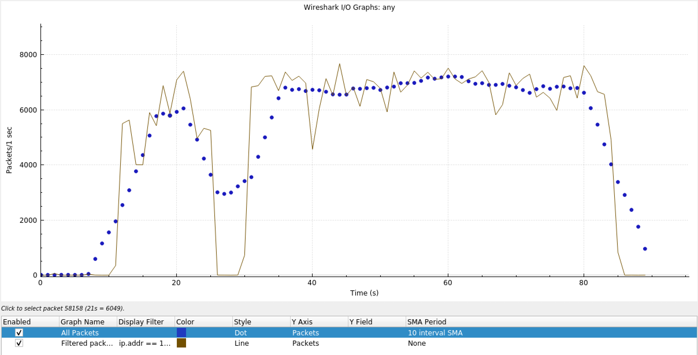
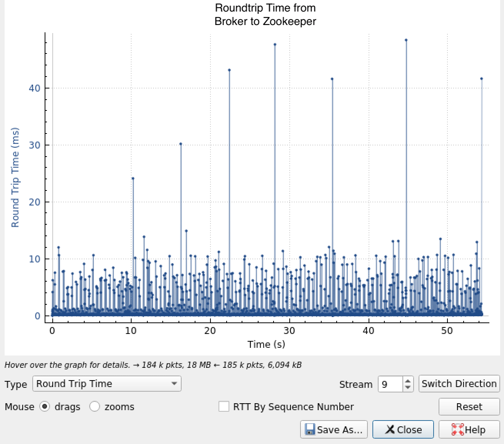

# Assignment 2
Developed by: Rick Tesmond and Jordan Smith

## Overview
In order to achieve anonymity between publishers and subscribers we have updated the source code to mask all ZeroMQ related function calls into a utility layer. An additional feature added to this assignment is the direct ability to disseminate from the publisher to the subscriber without the broker; this functioinality was misssing from the prior assignment. The middleware class has been updated and maintains the ability to act as a broker/proxy between publishers publishing topics, and subscribers consuming topics. The additional feature to this assignment is the implemntation of Zookeeper. This serves as node management system that handles all interactions between access from the middlware brokers to publishers and subscribers. 

To satisfy the requirements of the assiment we have updated the source code to remove:
- ZeroMQ functionality from the publishers and subscribers into an anonymous functions
- Implemeneted the Zookeper sever node management system that handles middleware broker nodes/objects: 
   * Handles connection ports
   * information dissemination
   * leader election

## Running the Program
System requirements: Ubuntu 20.04, ZMQ, Python3, Mininet, Xterm, Zookeper, Wireshark \
Git clone URL: https://github.com/Tesmond-Smith-CS6831/Assignment2

**Ensure your mininet infrastructure and Zookeeper server can speak with each other**

1. In your Ubuntu environment, clone our repo and cd into the root of our repo.

2. Open a terminal session, and enter (without the quotes) "sudo mn -x --topo=tree,fanout=3,depth=2".
   * If everything is installed properly, you should see 9 hosts spin up, and an Xterm window open for each host.
    * If this did not occur, make sure you have mininet and xterm installed.
    
3. Spin up the middleware file on any of the host terminals by utilize the command line input: python3 middleware.py'
    * Zookeeper handles all leadership elections in which the middleware broker objects, have their own unique access ports 
    
4. Spin up the Publishers on other hosts using 'python3 publisher.py ip-of-broker'
   * Example: 'python3 publisher.py 10.0.0.5 1/2 ZipCode(e.g. 23666)'
   * The publisher script can take three commandline arguments: 
      * ip-of-broker: IP address of the broker. Defaults to 'localhost'
      * publisher-flag: This input allows either input 1 - allows publishing of any topic vs. input 2 - publishing of singular topic. Defaults to 1
      * topic-to-publish: if input 2 is chosen, input for the specific topic to publish on. Defaults to 10001
          * Example: "python3 publisher.py localhost 2 45208"
    
5. Spin up the Subscriber on other hosts using 'python3 subscriber.py ip-of-broker topic-zip'
   * Example: 'python3 subscriber.py 10.0.0.5 53715 10' 
   * Subscriber script takes three command line args:
     * broker-ip: IP address of middleware broker. 'localhost' if running locally. Default: localhost
     * topic-zip: zipcode you are interested in receiving weather info from. Default: '10001'
     * number of times to listen for a specefic topic. Default: 10
    
**Ensure you execute Middleware first! Publisher and Subscriber order does not matter following middleware execution!**
    
As soon as the system is set up, you should begin to see Subscribers receiving information for their subscriber topics!
 * As a note, depending on the toggle switch used in the publisher, the time to receive information to the subscriber may vary

## Testing
### Unittesting
In order for the unit tests to run properly, ensure your dev environment has the dependencies necessary but running 'pip install -r requirements.txt'. This will load your environment with the necessary libraries.
Once this step is complete, simply run "python3 test.py".

Note the majority of these tests are connectivity tests; please follow the instructions above to fully test out our code/process!

### Simulations and Graph Output
Tested using Mininet and Wireshark.

To ensure our code matched the necessary use cases (approach #1 and approach #2), we ran simulations of the expected I/O rates and roundtrip packet times for our cases. These were captured by running wireshark in tandem with mininet to monitor all traffic and acknowledgements through our middleware.

Similar to what we witnessed in Assignment #1, we saw the expected performance boost from approach #1 where publishers disseminated topic information without dedication to a specific topic resulted in correct data responses from one host to another in a matter of seconds, while with approach #2, where publishers disseminated dedication topic information, successful delivery of the topic data to interested subscribers was almost instantaneous.

Regarding the new fault-tolerant broker setup with Zookeeper, functionality is successfully maintained even in the instance of nodes being killed off. However, unlike Assignment 1 where we had no set fault tolerance at the broker level and therefore all communication stopped until another middleware was spun up, we see an expected drop in communication when the node get killed off, but immediately regains request-response functionality thanks to the data watcher functionality:

The Node was killed at 26s, and only too 2s to instantiate the connection to the new broker node, and disseminate the new broker port info.

Following this trend, we don't notice any lapses in roundtrip time in the request/response cycles when the broker node was killed off either:

 

